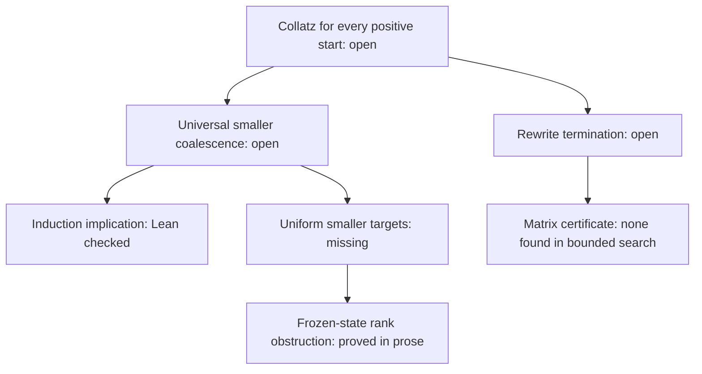

# Collatz research pass: stronger gap bounds, a rank obstruction, and checked semantics

## 0. Executive decision brief

**Verdict: a substantive contribution to this project, with Collatz still unresolved.**
The pass recovered the current repository, used independent constructive and
adversarial agents, derived two precise auxiliary results, and added a
machine-checked bridge from the existing coalescence identities to strong
induction. This is new work relative to the input repository, not a claim of
priority in mathematics.

Input: `Sodelin/Collatz-Conjecture-Work` at
`343ddb2cbfadb91af65328f2614c572dc91a2d69`. The older August 24 handoff was
superseded by the current Round-8 records. Work is reviewable in
[draft PR 16](https://github.com/Sodelin/Collatz-Conjecture-Work/pull/16).

| Contribution | Exact change | Evidence strength |
|---|---|---|
| Near-return gap | `d<s/3` becomes **`d<s/4`** for every non-descending first coefficient contraction. | Universal prose derivation, independent reconstruction, exact finite certificate; not Lean-formalized. |
| Conditional first-frontier bound | Existing `24,019,143,996` becomes **`17,340,869,984`** with the sharper 1024-term certificate and inherited `4|d`. | Exact rational arithmetic, under the existing L8/L11 frontier hypotheses. |
| Ranking obstruction | An expanding two-return family defeats every lower-bounded label-dependent polynomial in parameter, bitlength, and the existing debt variables. | Symbolic affine certificate and independent proof reconstruction; no all-ranks claim. |
| 3-adic extension | Hard returns reset 3-adic depth to one; a second family defeats augmented polynomial/cofactor ranks. | Universal algebra, guarded family, finite regression; not Lean-formalized. |
| External closure claims | Summable projected discrepancies force exact equidistribution; an explicit measure refutes asserted non-atomic Haar uniqueness. | Primary-text audit and independently reconstructed counterarguments; no positive-integer disproof. |
| Direct closure search | Dimension 2 natural-matrix search included all eleven rewrite rules. | Bound 2: Z3-reported UNSAT; bound 8: timeout. No general exclusion or closure. |
| Formal semantics | Exact convergence/coalescence and strong-induction criteria, including the existing compatible child. | Official pinned Lean 4.33.1 build; nine audited axiom reports. |
| Reproduction | GitHub CI runs the unchanged Lean release and exact Python checks. | Actual successful execution, not merely a configured workflow. |

The quarter coefficient is 25% smaller than the old coefficient. This is a
reduction in an upper bound, not a percentage of Collatz solved. The exact
remaining obstacle is a universally valid mechanism for descent or coalescence
that survives all hard returns, or a genuine positive counterexample.

## 1. Abstract

We tested whether the latest lemma chain closes the Collatz conjecture and
attempted specific improvements where it does not. A finite phase-maximization
argument proves a uniform rotation-block bound and sharpens the first-contraction
near-return estimate. A two-step hard-return family fixes the measured label
and debt while size grows, yielding a broader no-go theorem for polynomial
ranks. Separately, formal convergence semantics validate the induction use of
existing local identities. None supplies universal termination.

## 2. Introduction

The relevant map is `T(n)=n/2` for even `n`, and `(3n+1)/2` for odd `n`.
Here `1` maps to `2` and back to `1`; this detail matters in formal proofs.
The project already had valid local identities and several exact obstructions,
but its continuation record correctly identified a missing global mechanism.
The distinction between coefficient contraction and actual descent is also
central in [Rozier and Terracol's primary paper](https://arxiv.org/html/2502.00948v5).

## 3. Method

We pinned the full repository input, inspected its claim and failure registries,
and split constructive mathematics, hostile review, runtime verification, and
formal semantics across agents. The parent independently replayed both new
checkers and reviewed their proofs. The constructive agent reconstructed the
quarter-bound argument independently; the formal-semantics reviewer separately
checked the polynomial argument. Shared model provenance means these are
internal checks, not independent external peer review.

Finite computation was used only after specifying its coverage argument.
The quarter proof reduces infinitely many `s` to arbitrary-phase blocks plus
107 small exact inequalities. The rank proof uses a universally guarded affine
family; 1,003 numerical replays are additional regression checks.

A second closure attempt used alphaXiv discovery and raw primary PDF text,
with parallel 3-adic-coordinate, source-bridge, and matrix-interpretation
attacks. The invariant-measure and quantifier arguments received a separate
cold review against the exact source definitions. Wolfram's connection failed
with a 404 during probing, so no computation is attributed to Wolfram.
The selected Data Analytics plugin exposed the working repository connector.
Optional Product Design, Hugging Face, and special-function capabilities did
not supply a necessary mathematical step. No callable `app_block` endpoint
was exposed. Capability availability is not counted as research evidence.

## 4. Findings

### 4.1 A stronger bound from the existing lemmas

For odd count `s`, first coefficient-contraction time `tau`, and nonnegative
gap `d=T^tau(n)-n`, [L15](proof-search/lemmas/L15_Quarter_Gap_and_Rotation_Block_Certificate.md)
proves

\[
4d<s,\qquad d\le\left\lfloor\frac{s-1}{4}\right\rfloor.
\]

Its block maximum covers every real starting phase. This supplies the infinite
part of the argument; the script does not infer infinity from sampled orbits.
At the existing illustrative odd count `72,057,431,991`, the quarter bound with
L11 yields `18,014,357,996`; the 1024-term certificate gives `17,340,869,984`.
The associated L12 valuation ceiling stays `34`, so that particular downstream
classification does not improve.

### 4.2 Why increasing polynomial complexity cannot fix the current rank

The [frozen-debt obstruction](proof-search/routes/AB_frozen_debt_size_rank_no_go.md)
proves, for every integer `u>=0`,

\[
65536u+47771\xrightarrow{F}110592u+80615
\xrightarrow{F}279936u+204059.
\]

Both endpoints have `(L,epsilon,D,R)=(2,1,2,0)`, while their parameter grows by
more than fourfold. Any lower-bounded polynomial in parameter and bitlength
with these fixed debt values eventually increases or stays constant along
the displayed pairs. A rank strictly decreasing on both edges would require
the opposite. The same reasoning excludes finite lexicographic tuples when
each coordinate is lower bounded.

This strengthens the old affine-rank failure. It does not exclude every
nonlinear rank: nonpolynomial behavior, additional arithmetic state, and
stronger coalescence certificates remain outside the theorem.

### 4.3 Formal bridge and a working verification route

[ConvergenceStatement.lean](lean/CollatzWork/ConvergenceStatement.lean) defines
the exact target independently of the solution proofs.
[Convergence.lean](lean/CollatzWork/Convergence.lean) proves finite-prefix
invariance, coalescence equivalence, all-start descent equivalence, and
the smaller-coalescing-start induction criterion. It then applies these
semantics to the existing compatible Mersenne child.

The universal smaller-target premise is explicit and remains unproved.
The new declarations do not disguise that premise as an axiom.
[The successful CI run](https://github.com/Sodelin/Collatz-Conjecture-Work/actions/runs/33965738739)
checked commit `192e62b707205ae6181212eeb25ee304f6b12c71`; selected version,
build, and axiom lines are [retained here](verification/lean_convergence_ci_2026-09-05.txt).

### 4.4 Adding 3-adic information still leaves an expanding frozen state

Write `n+1=2^a*3^b*lambda` with `gcd(lambda,6)=1`. The
[new exact calculation](proof-search/routes/AB_three_adic_rank_no_go.md)
shows `v3(Y+1)=1` after every raw hard macro. For every `t>=0`,

\[
589824t+244379\xrightarrow{F}995328t+412391
\xrightarrow{F}2519424t+1043867.
\]

The endpoints share `(L,e,b,D,R)=(2,1,1,2,0)`, while the coprime cofactor
grows from `49152t+20365` to `209952t+86989`, more than fourfold. Thus
polynomial/cofactor ranks with arbitrary dependence on these frozen
measurements, and finite lexicographic versions with lower-bounded coordinates,
cannot decrease universally. Williams's coordinate paper supplies exact
identities but leaves its boundary sequence and cofactor recurrence open.

### 4.5 Primary-source checks prevent two false closure shortcuts

The [source audit](proof-search/sources/Primary_Bridge_Audit_2026-09-05.md)
finds that Dhiman–Pandey's full-reachability nondefinability theorem applies
to classical Collatz. It does not prohibit finite guarded graphs with
unbounded ranks: a terminating halving/odd-to-one system separates these
notions. Route B remains available.

For Chang v6's definitions, projected total-variation discrepancies obey
`delta_(K+1)>=delta_K>=0`; a finite sum forces every `delta_K=0`. Its WMH
therefore supplies no weakening of fixed-depth equidistribution, and its
existential growing-depth OEC is equivalent by diagonalization. Separately,
independent fair valuation digits in `{1,2}` give the continuous coding

\[
x(v)=-\sum_{j\ge0}2^{v_0+\cdots+v_{j-1}}/3^{j+1},
\qquad U(x(v))=x(\operatorname{shift}v).
\]

Its pushforward is a non-atomic, non-Haar invariant probability measure.
This refutes the asserted uniqueness conclusion, while leaving the status of
separately stated conditional spectral antecedents explicit. It concerns a
2-adic measure, not a divergent positive integer. These counterarguments do
not establish mathematical priority.

### 4.6 A direct matrix-certificate attempt reaches a bounded negative result

The [retained search](verification/yah_natural_matrix_2d/README.md) assigns
dimension 2 natural affine interpretations to all seven rewrite symbols.
All eleven rules must decrease weakly and at least one must decrease strictly,
with context monotonicity enforced. A valid first removal would combine with
the published terminating proper subsystems to close the rewrite route.
Published Example 4.3 passed both the independent integer checker and the
SMT encoding as a positive control.

| Coefficient range | Outcome | Interpretation |
|---|---|---|
| 0–2 | UNSAT in 0.488 seconds | Solver-reported finite-template exclusion; no checked UNSAT proof certificate. |
| 0–8 | Timeout at 60.021 seconds | No exclusion and no witness. |

This attempt produced no universal certificate. It neither rules out all
dimension 2 interpretations nor exhausts richer termination methods.

## 5. Conclusion

The pass strengthens a necessary condition, rules out a broader attempted
mechanism, and closes a formal semantics gap. The full conjecture still does
not follow. The new upper bound does not prove coefficient-stopping finiteness,
exclude zero-gap cycles, or justify repeatedly restarting the least-counterexample
argument at a larger endpoint.
The second pass strengthens the rank obstruction and rejects specific invalid
external bridges; its direct solver search leaves the global goal open.

## 6. Deconstructive analysis

From the global goal downward, every universal proof still needs complete
coverage and a well-founded mechanism. The semantic theorem explains what
a smaller-coalescence certificate would need to accomplish; it does not
construct that certificate. The frozen-debt family shows why one broad
choice of measure cannot supply it.

## 7. Reconstructive analysis

From exact arithmetic upward, L9 bounds the remainder, phase blocks bound the
rotation sum, and positivity makes the defect inequality strict. Separately,
two verified affine macros return to the same measured state while increasing
size; polynomial asymptotics turn that identity into the no-go theorem.

## 8. Middle-out synthesis and next action

Route AB should remain blocked until a candidate distinguishes the displayed
endpoint family through genuinely additional information or a stronger
smaller-target relation. Searching higher polynomial degrees in the same
variables is now ruled out. For the quarter result, the highest-value
verification follow-up is formalizing the phase-maximization theorem and its
L9 dependency. Neither action should be presented as guaranteed closure.

The full-closure hierarchy tested two concrete proof obligations:



The arrows organize obligations and outcomes. Future Route AB candidates
must handle the stronger 3-adic frozen family. Route A remains open to an
explicit different interpretation or transformation. Full-reachability
nondefinability does not eliminate finite ranked graph certificates.

## 9. Glossary

| Term | Meaning here |
|---|---|
| Coefficient contraction | The multiplier `3^s/2^tau` first becomes smaller than one. |
| Near-return gap | The nonnegative integer `d` by which the endpoint exceeds the start. |
| Coalescence | Two starts share a later orbit value, possibly after different step counts. |
| Rank | A proposed measure that decreases along transitions and must support a well-founded argument. |
| Debt | L13's exact valuation `D` and normalized count `R`; these are mathematical state variables. |
| Formal verification | Acceptance of specific theorem statements by the pinned Lean checker. |

## 10. Bibliography and source roles

- Rozier, O., and Terracol, C. *Paradoxical behavior in Collatz sequences.*
  [arXiv:2502.00948v5](https://arxiv.org/html/2502.00948v5).
  Role: primary context for coefficient contraction versus actual descent;
  the new quarter bound is derived in this repository.
- Zhu, S., and Kincaid, Z. (2024). *Breaking the Mold: Nonlinear Ranking
  Function Synthesis without Templates.*
  [arXiv:2409.18063](https://arxiv.org/html/2409.18063v1).
  Role: broader polynomial/lexicographic synthesis context; no claimed exact
  match to our hard-return family.
- Neumann, E., Ouaknine, J., and Worrell, J. (2020). *On Ranking Function
  Synthesis and Termination for Polynomial Programs.*
  [DOI:10.4230/LIPIcs.CONCUR.2020.15](https://doi.org/10.4230/LIPIcs.CONCUR.2020.15).
  Role: scope comparison. Their compact real semi-algebraic setting does not
  supply a termination theorem for this unbounded integer hard-return system.

Targeted searches for the quarter formula, mechanical remainder bounds,
polynomial/bitlength Collatz ranks, and the displayed integer witness did
not locate an exact match. This was a bounded search, not a systematic
priority investigation. No novelty or publication-readiness claim follows.

The second pass also read primary texts by
[Yolcu–Aaronson–Heule](https://arxiv.org/abs/2105.14697v3),
[Williams](https://arxiv.org/abs/2607.01718v1),
[Dhiman–Pandey](https://arxiv.org/abs/2602.06066v2), and
[Chang](https://arxiv.org/abs/2603.11066v6). Their source roles and exact
audited pages are in the linked notes. Generated paper summaries were not
accepted as proof evidence.

## 11. Metacognitive review: process integrity

**Process-integrity band: strong for the stated internal verification task;
limited for novelty and external validation.** Input identity, map convention,
proof scope, exact output, and Lean dependencies are recorded. Mathematical
review roles were separated and the finite-to-infinite step was specifically
challenged. The initial local Lean failure was recorded and resolved through
an ordinary remote runner, without changing the trusted executable.

This is not a systematic empirical review: PRISMA, AMSTAR-2, RoB-2, and
clinical GRADE scoring do not apply as validated scoring instruments here.
The useful process checks are coverage, dependency fidelity, reproducibility,
and independent reconstruction. Remaining fixes: external specialist review,
broader prior-art search, and formalization of the two new mathematical notes.

The second pass preserved separate raw-source reading, proof reconstruction,
and solver validation roles. The invariant-measure proof received an explicit
domain correction for the singular point `-1/3`; the source audit distinguishes
an asserted conclusion from the antecedent of a conditional proposition.
The bounded UNSAT report is deliberately weaker evidence than the repository's
independently reconstructed scalar-arctic proof certificates.

## 12. Metacognitive reflection: robustness of inference

**Robustness verdict: the exact scoped results survived internal challenges;
global closure remains unsupported.** No effect-size pooling, Q, tau-squared,
I-squared, or publication-bias test is meaningful for these deductive claims.
The relevant sensitivities are omitted phase maxima, incorrect parity guards,
small-index endpoints, quantifier changes, and the lower-bound hypothesis
on every lexicographic coordinate.

We would retract the quarter theorem upon an uncovered phase maximum or a
failed integer certificate, and retract the polynomial claim upon a valid
rank inside its exact class or a failure of the universal affine family.
A rank using extra state would change the route prospect without falsifying
the scoped no-go. A future counterexample or proof of Collatz would be assessed
separately; this pass supplies neither.

For the source audit, changing the discrepancy quantifiers or imposing a
specified growth rate for the modulus could change the equivalence claim;
that would be a different hypothesis. The invariant-measure construction
does not establish anything about a positive orbit. A different matrix
coefficient bound, dimension, carrier or orientation is outside the bounded
negative experiment. The larger search timeout supports no mathematical
exclusion.

## 13. Zotero and Obsidian integration

Import [the BibTeX file](ASTRA_REFERENCES_2026-09-05.bib) into a collection
named `Collatz / 2026-09-05 audit`. The entries contain role-oriented keywords.
Relate Rozier–Terracol to L9/L10/L15 as background; relate the ranking papers
to the rank-obstruction note as method/scope context. Keep the project notes
as repository-linked research notes, not peer-reviewed article items.

Open the repository as an Obsidian vault or use the existing synced checkout.
The relative links preserve connections among the new notes, evidence, and
canonical registries. Zotero receives bibliographic sources; Git retains
the authoritative mathematical and verification state.

## 14. Appendix: reproduction and recovery

From the repository root, run:

```sh
python -B verification/near_return_quarter_bound.py
python -B verification/hard_return_frozen_debt_check.py
python -B verification/three_adic_hard_return_check.py
python -B verification/primary_bridge_counterexamples.py
python -B verification/check_note_graph.py
lake build
lake env lean lean/CollatzWork/Convergence.lean
```

Use the pinned toolchain. Python checks require only the standard library;
the quarter checker refuses optimized mode because its assertions are part
of verification. [The workflow](.github/workflows/verify.yml) runs these
checks on GitHub and includes the formerly omitted two-pump module in the
umbrella build. The local Work Mode process-path incompatibility still
prevents directly launching Lean here; the successful remote build is the
formal evidence.

The draft branch preserves the original main baseline. To decline this pass,
leave the PR unmerged. To resume, read the [continuation](CONTINUATION.md),
new notes, and retained outputs at the actual PR head. Do not infer that
any unreviewed future change inherits this pass's verification.

The optional [Z3 experiment](verification/yah_natural_matrix_2d/README.md)
has separate pinned dependency and timeout instructions; it is not a CI gate.
Its result, exact SMT instances, all new proof notes, checker outputs and
source references are preserved in the draft branch.

## Connections

- **Depends on:** [current claim registry](proof-search/CLAIM_REGISTRY.md).
- **Strengthens:** [L15 quarter bound](proof-search/lemmas/L15_Quarter_Gap_and_Rotation_Block_Certificate.md).
- **Records:** [frozen-debt obstruction](proof-search/routes/AB_frozen_debt_size_rank_no_go.md).
- **Records:** [3-adic obstruction](proof-search/routes/AB_three_adic_rank_no_go.md), [source audit](proof-search/sources/Primary_Bridge_Audit_2026-09-05.md), and [bounded matrix attempt](verification/yah_natural_matrix_2d/README.md).
- **Verified by:** [reproduction manifest](verification/README.md) and [Lean scope](LEAN_TARGETS.md).
