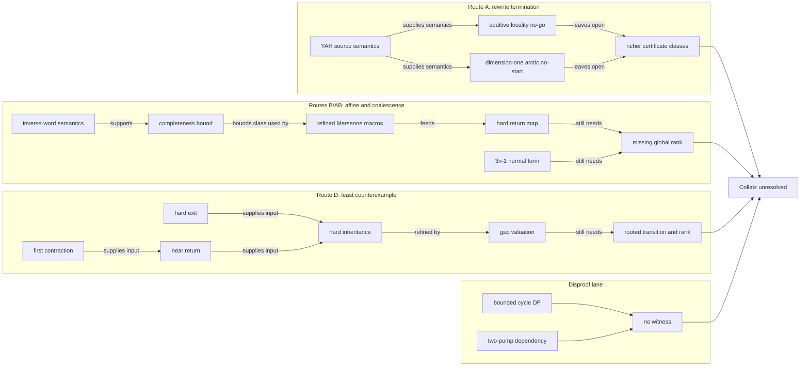

# Collatz research atlas

**Node ID:** `Collatz-Conjecture-Work:ATLAS`

**Node type:** `map`

This is the repository's map of content. It makes the mathematical dependency
graph visible without replacing the canonical status records.

> **Status boundary:** the Collatz conjecture remains unresolved. A route-class
> obstruction, a checked finite computation, a normal form, or a
> Collatz-equivalent reformulation is not a proof or disproof.

For current truth, use the [claim registry](proof-search/CLAIM_REGISTRY.md),
[approach registry](proof-search/APPROACH_REGISTRY.md), and
[verification manifest](verification/README.md). This atlas is navigation, not
a second status ledger.

## How to read the graph

- **depends on** means the target supplies a stated mathematical or semantic
  input.
- **strengthens** means the later result closes a strictly richer certificate
  class at its stated scope.
- **blocks** means a proposed mechanism is refuted, not that Collatz is refuted.
- **verified by** points to executable or formal evidence.
- **parallel to** means two results expose the same frontier without implying
  one another.

Every load-bearing relationship shown in Mermaid below is repeated as an
ordinary relative Markdown link in the route maps. Mermaid is a visual aid;
the links are the portable graph data used by GitHub and Obsidian.

## Current frontier

## Canonical state and reading paths

- Start with the [README](README.md), [latest accepted state](LATEST.md), and
  [plain-language public status](PUBLIC_STATUS_2026-08-24.md).
- Review atomic confidence, evidence, novelty, and readiness only in the
  [claim registry](proof-search/CLAIM_REGISTRY.md).
- Review live route status and reopening conditions only in the
  [approach registry](proof-search/APPROACH_REGISTRY.md).
- Check rejected and superseded mechanisms in the
  [failure ledger](proof-search/FAILURE_LEDGER.md).
- Continue work from the [continuation checkpoint](CONTINUATION.md), after
  consulting the [missing-lemma ladder](proof-search/MISSING_LEMMA_LADDER.md).

## Route A — mixed-radix rewrite termination

1. [YAH source integration](methodology/YAH_REWRITE_SOURCE_INTEGRATION_2026-08-23.md)
   fixes the published rewrite rules and Collatz-reflection semantics.
2. [Unlabeled adjacent-edge cancellation](proof-search/routes/A_yah_2local_edge_potential_no_go.md)
   and the [fixed two-state symbol/edge cancellation](proof-search/routes/A_yah_two_state_semantic_label_no_go.md)
   block two additive locality classes.
3. The [dimension-one scalar-arctic no-start theorem](proof-search/routes/A_yah_two_state_scalar_arctic_full_no_start.md)
   separately closes every standard first full or YAH-supported top step in
   that carrier and dimension.
4. [Route A in the approach registry](proof-search/APPROACH_REGISTRY.md) records
   the exact remaining classes; [Lean targets](LEAN_TARGETS.md) records what is
   not formalized.

The YAH cancellation packets are the archive's strongest narrow external-review
targets. Their exact novelty is not certified; see the
[primary-source audit](proof-search/CLAIM_REGISTRY.md#primary-source-novelty-audit).

## Routes B/AB — residues, inverse words, and coalescence

The main affine chain is:

1. [L0 — global descent equivalence](proof-search/lemmas/L0_Global_Descent_Equivalence.md)
2. [L1 — exact prefix descent bound](proof-search/lemmas/L1_Exact_Prefix_Descent_Bound.md)
3. [L2 — cylinder refinement and slope pruning](proof-search/lemmas/L2_Cylinder_Refinement_and_Slope_Pruning.md)
4. [L3 — trailing ternary-two coalescence](proof-search/lemmas/L3_Trailing_Ternary_Two_Coalescence.md)
5. [L4 — general inverse-word coalescence](proof-search/lemmas/L4_General_Inverse_Word_Coalescence.md)
6. [L5 — inverse-word completeness bound](proof-search/lemmas/L5_Inverse_Word_Search_Completeness_Bound.md)
7. [Mersenne inverse-word no-go](proof-search/routes/AB_mersenne_inverse_word_no_go.md)
8. [L13 — refined Mersenne child macros](proof-search/lemmas/L13_Refined_Mersenne_Child_Macros.md)
9. [Hard boundary return system](proof-search/routes/AB_hard_boundary_return_system.md)

The [recursive residue-graph design](proof-search/routes/B_recursive_residue_graph.md)
and [mixed-radix bridge](proof-search/routes/AB_mixed_radix_coalescence_bridge.md)
describe the intended certificate architecture. The
[3n-1 trajectory normal form](proof-search/lemmas/L14_ThreeNMinusOne_Trajectory_Normal_Form.md)
is parallel to the hard-return normalizer: both strictly reduce selected
macros, but neither supplies termination of the residual global dynamics.

## Route D — least-counterexample chain

1. [L6 — minimal counterexample exit constraint](proof-search/lemmas/L6_Minimal_Counterexample_Exit_Constraint.md)
2. [L7 — coefficient barrier](proof-search/lemmas/L7_Least_Counterexample_Coefficient_Barrier.md)
3. [L8 — Farey-certified barrier](proof-search/lemmas/L8_Farey_Certified_Coefficient_Barrier.md)
4. [L9 — first-contraction envelope](proof-search/lemmas/L9_First_Contraction_Mechanical_Envelope.md)
5. [L10 — near-return and dual residue](proof-search/lemmas/L10_Near_Return_and_Dual_Residue_Certificate.md)
6. [L11 — hard-exit inheritance](proof-search/lemmas/L11_Near_Return_Hard_Exit_Inheritance.md)
7. [L12 — gap-valuation transition](proof-search/lemmas/L12_Hard_Exit_Gap_Valuation_Transition.md)

The [failure ledger](proof-search/FAILURE_LEDGER.md) records why the L11
renewal promotion fails. The remaining obligation is a rooted transition and
well-founded rank, not another unrooted near-return estimate.

## Disproof search

- The [max-C cycle-DP audit](proof-search/disproof/CODEX_DISPROOF_CYCLE_DP_AUDIT_2026-08-24.md)
  is an exact bounded negative search, replayed by the
  [verification manifest](verification/README.md).
- The [two-pump dependency audit](proof-search/disproof/CODEX_TWO_PUMP_DEPENDENCY_AUDIT_2026-08-24.md)
  and its [Lean target](LEAN_TARGETS.md) prove that cyclic rotation alone gives
  a dependent resultant.

Neither artifact supplies a positive nontrivial cycle or a divergent positive
orbit.

## Evidence and formalization

- [Verification and reproduction manifest](verification/README.md)
- [Lean target boundary](LEAN_TARGETS.md)
- [Lean verification policy](lean/VERIFICATION_POLICY.md)
- [Provenance policy and immutable objects](PROVENANCE.md)
- [Repository note-graph standard](methodology/NOTE_GRAPH_STANDARD.md)

Run `python -B verification\check_note_graph.py` to check every local Markdown
target and confirm that every note is reachable from this public entry graph.

## Methodology and prompt programs

- [Research Protocol V2](RESEARCH_PROTOCOL_V2.md)
- [Shared proof-attack integration](methodology/SHARED_PROOF_ATTACK_STRUCTURE.md)
- [Toolchain and prompt integration](methodology/TOOLCHAIN_AND_PROMPT_INTEGRATION_2026-08-23.md)
- [Anthropic workflow notes](methodology/ANTHROPIC_RH_WORKFLOW_NOTES.md)
- [Rozier–Terracol–Bařina source integration](methodology/ROZIER_TERRACOL_BARINA_SOURCE_INTEGRATION_2026-08-23.md)
- [Collatz Orchestrator V3](prompts/COLLATZ_ORCHESTRATOR_V3.md)
- [Collatz Orchestrator V2](prompts/COLLATZ_ORCHESTRATOR_V2.md), retained as
  the superseded prompt-program checkpoint

The reusable architecture lives in `Sodelin/Proof-attack-structure`; the
Collatz repository remains authoritative for Collatz mathematics and status.

## Provisional synthesis and publication gates

- [Effective-flash review notes](proof-search/effective-flashes/README.md)
  preserve exact issue-derived route facts without adding claim-registry rows.
- [YAH scalar-arctic publication candidate](publication/YAH_SCALAR_ARCTIC_CANDIDATE.md)
  records independent correctness, priority, dependency, reproducibility,
  source, attribution, reporting, and review gates. Its decision is `HOLD`.
- [Generated catalog and backlinks](knowledge/README.md) expose every Markdown
  file while remaining subordinate to this hand-curated atlas.
- [AI-assisted source-card map](knowledge/sources/INDEX.md) preserves the
  Zotero import manifest, stable item links, citation identifiers, project use,
  and human-review boundary for 36 references.

These are audit and packaging views. They do not change the unresolved verdict
or the canonical status hierarchy.

## Historical archive

- [Original handoff](CODEX_HANDOFF_2026-08-23.md)
- [Cycle-1 closure audit](proof-search/CODEX_CYCLE_1_CLOSURE_AUDIT_2026-08-23.md)
- [Round 6A public review note](papers/round-6a/Theorem_6A1_Public_Review_Note.md)
- [Round 6B public summary](papers/round-6b/Round6B_Public_Summary.md)

Historical files preserve provenance. They may use older route language and
must not override the current registries.

## Reopen conditions

- Route A: a dimension at least two, different carrier or labeling,
  transformation, non-coefficientwise order, or separately proved closed local
  relation with an exact certificate.
- Routes B/AB: a guarded finite/regular graph with a genuinely well-founded
  back-edge rank that survives the known Mersenne and recharge obstructions.
- Route D: a rooted transition theorem covering finite and infinite
  coefficient-stopping branches.
- Disproof: an exact positive witness, replayed before broader interpretation.

If a proposal cannot name the old blocker and the new mechanism that bypasses
it, it belongs in the failure ledger rather than a new route.
