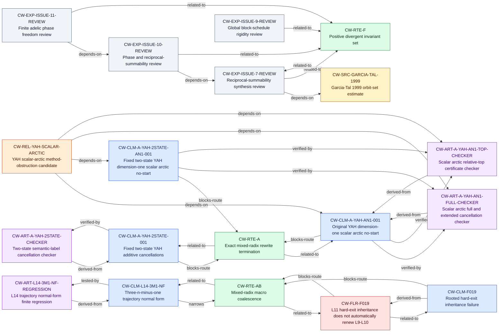

<!-- GENERATED by knowledge/tools/build_index.py; DO NOT EDIT. -->
# Route, claim, failure, and artifact graph

> Collatz remains unresolved. This view is navigation metadata, not a proof graph.

For every edge's exact scope, open the source card and then its canonical target.
